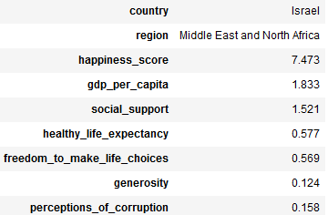
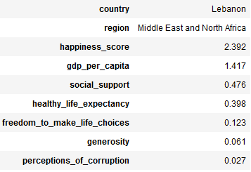
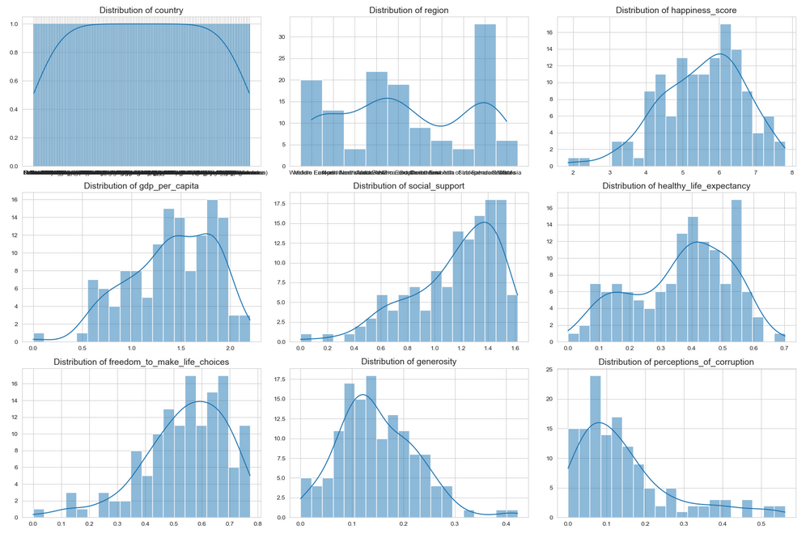
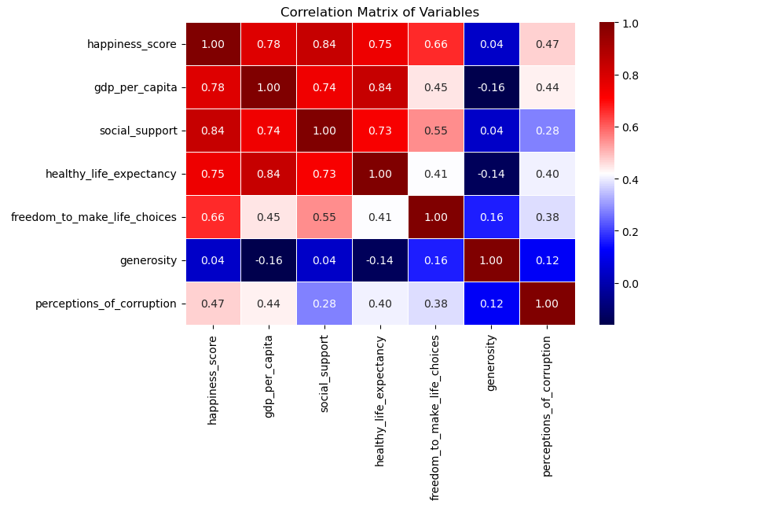
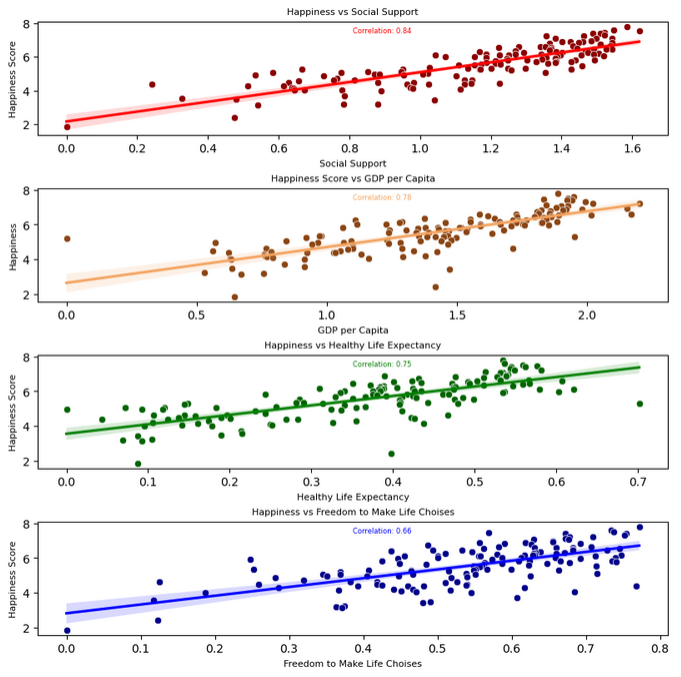
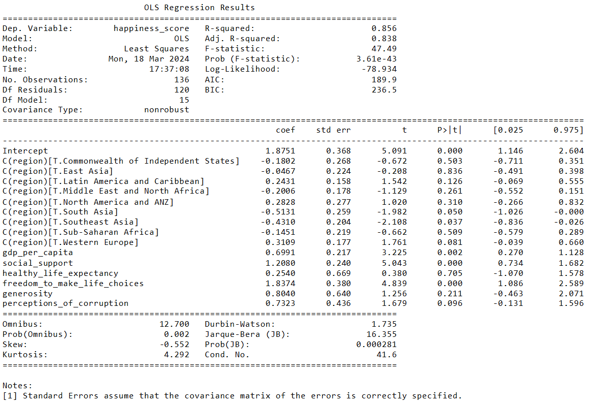
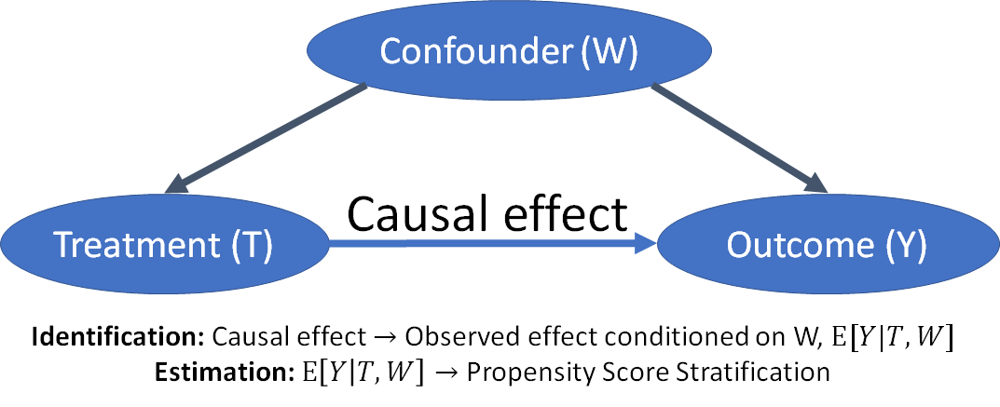

<h1 align='center'> World Happiness Index 2023 Analysis </h1>


The Global Happiness Index through 2023 delivers an extensive and current analysis of happiness measures and the determinants affecting global well-being. Aimed at furnishing critical insights for decision-makers,
scholars, and those keen on exploring the nuances of happiness and welfare across the globe, 
this dataset serves as a pivotal resource for comprehending the complexities of contentment and quality of life internationally. The propose of this Analysis is to both shows the variables that is correlated to higher happiness score, 
and the estimated causal effect that each numerical variable on happiness score. 

##  The DataFrame

| Column | Description |
| ----------- | ----------- |
| country | The name of the country |
| region | The geographic region or continent |
| happiness_score | A measure reflecting overall happiness |
| gdp_per_capita | A measure of Gross Domestic Product per capita |
| social_support | A metric measuring social support |
| healthy_life_expectancy | A measure of years of healthy life expectancy |
| freedom_to_make_life_choices | A measure of freedom in life choices |
| generosity | A metric reflecting generosity |
| perceptions_of_corruption | A measure of perception of corruption within a country |

## Tools 

It Was used the Jupyter Notebook (Python IDE) to host the analysis, and was used the following Python Libraries:

- Pandas is a library providing high-performance, easy-to-use data structures, and data analysis tools. It is particularly suited for working with tabular data (similar to Excel spreadsheets).

- NumPy offers comprehensive mathematical functions, random number generators, linear algebra routines, Fourier transforms, and more.

-  Matplotlib a plotting library that is highly customizable and capable of creating static, animated, and interactive visualizations in Python.

- Seaborn built on top of Matplotlib, Seaborn is a statistical data visualization library designed to make visualization a central part of exploring and understanding data.

- SciPy is built on NumPy and provides additional functionality with submodules for optimization, integration, interpolation, eigenvalue problems, algebraic equations, differential equations, and others.

-  Statsmodels focuses on statistical models, hypothesis tests, and data exploration. Statsmodels is great for conducting statistical tests and inferences.

- Plotly.express a high-level API for creating figures. It is designed to make the creation of complex, beautiful visualizations easy with a simple syntax, that can be manipulated live.

- DoWhy a library for causal inference that simplifies the use of advanced causal inference techniques. It provides a principled way to model your assumptions and estimate causal effects based on those assumptions, making it easier to apply causal analysis in practice.


## Propose of the Analysis

### Bussiness Problem

The **Foreign Relations Minister** was invited to an Internacional Wellbeing Conference, and he was selected to do a presentation of what makes a country happier. The **Cabinet Sub Secretary** for the Foreign Relations Minister knows someone who have the knowleadge to solve this problem, so, he contacts the Data Science **Manager** of the Federal Government Secretary and explain the demand of the **Minister**.

After the meeting, the **Manager** understand that the problem is more on the Econometry field, he also remembered that he hired someone whom had completed the Aplied Econometry Course from the *São Paulo* University, and this person is you, a **Data Scientist Intern**. The **Manager** knows that you are still learning, and you think that he's crazy by choosing you to do a project for the **Foreign Relations Minister**, but he explains that it is your chance to show what you made of, and you accept the challenge (just like if you had another choice).

Another thing that the Manager mentioned, is that the **Sub Secretary** needs this report ASAP, so you must hurry! 😧

### Project Objects

The objective is to investigate the factors associated with national happiness scores and provide insights that can inform the development of public policies aimed at promoting societal wellbeing. The project advocates for a comprehensive approach to policymaking, wherein economic prosperity, physical health, social cohesion, and individual freedoms are considered collectively in fostering national happiness. By recognizing the interplay between these variables, governments, organizations, and individuals can devise more effective strategies for cultivating happier and more resilient societies.

## Analysis

### EDA

#### Israel and Lebanon Happiness Difference

> In our exploration of the World Happiness Index, we've uncovered that the Middle East and North Africa exhibit the most significant disparity in happiness scores. Interestingly, the countries showcasing this stark contrast are neighboring nations. Israel stands out with a happiness score of 7.473, making it the fourth happiest country in 2023. On the other hand, Lebanon's score of 2.392 places it as the second-to-last in the ranking, highlighting a remarkable difference of 5.081 points between the two. This variance between adjacent countries underscores the complex interplay of factors influencing national happiness levels.

Israel 



Lebanon




The Map shows the visual discrepancy of happinesse index between Israel and Lebanon


#### Top and Least countries

> the top 10 and least 10 countries sorted by happiness score in the 2023 year.


#### Happiness Mean by Region

> Our analysis indicates that, with the exception of North America and Australia & New Zealand (ANZ), as well as Western Europe—which are identified as the "happier" regions—and Sub-Saharan Africa and South Asia, recognized as the "less happy" regions, the happiness scores across all other regions exhibit a notable similarity. This finding suggests a level of uniformity in happiness scores outside the extremes of the happiness spectrum, highlighting a middle ground where most other regions align in terms of their happiness levels.


#### Distribuition 

> Happiness Score: Leaning towards a less cheerful revelation, the happiness score distribution hints at a world where, despite a lean towards more content nations, the pursuit of happiness is unevenly distributed. A gloomy reminder that not all countries share in the global smile.

> GDP per Capita: Peering into the economic divide, it's clear that wealth is a privilege enjoyed by few. The majority trudge along at the lower end of prosperity, painting a stark picture of the global financial chasm.

> Social Support: A silver lining in an otherwise cloudy sky, the tilt towards better social support across most countries offers a glimmer of hope. Yet, the uniformity in support remains a distant dream for many.

> Healthy Life Expectancy: The health landscape reveals a moderate lean towards better life expectancy, yet the shadow of nations left behind looms large. It's a harsh reminder of the health disparities that plague our world.

> Freedom to Make Life Choices: While a semblance of freedom to choose one’s life path is visible, the distribution's slight peak at the higher end whispers the sad truth of freedoms not universally felt.

> Generosity: A skewed view towards lower generosity unearths the harsh reality of a world where selflessness is not as widespread as one might hope, with only a faint trail of countries showing higher levels of giving.

> Perceptions of Corruption: The heavy skew towards seeing low levels of corruption, contrasted by a significant tail of countries perceiving rampant corruption, unveils a world grappling with trust issues, where faith in institutions is often a coin toss.



#### Correlation Map

> This heatmap helps us see how all these different things are connected and how they can influence how happy a country is. It's like a guide that shows us what makes life better for people living in different places.



#### Scatter Plot of the Highiest Happiness Correlation Feactures

> The chart we looked at shows which things are most connected to how happy countries are. It seems that having good support from friends or family, being wealthier (which is what "GDP per Capita" means), and being free to make your own choices all really help make a country's happiness score go up. This means these three things could be big reasons why some countries are happier than others.



#### Analysis by Region

> Happiness Across Different Places: Different places in the world have different levels of happiness. Places like North America, Australia, New Zealand, and Western Europe are the happiest. This shows that places with more money tend to be happier.

> Money and Happiness: Places with more money, or a higher GDP per capita, usually have better stuff like roads, hospitals, schools, etc. This leads to people being happier. In terms of money, East Asia is pretty close to North America, Australia, New Zealand, and Western Europe.

> Living a Long and Healthy Life: Just like with happiness and money, how long and healthy people's lives are varies a lot from place to place. Places with more money and happier people also tend to live longer and healthier lives. East Asia does really well in this, only behind Western Europe.

> Having Support from Others: In places where the economy is strong, people usually have a lot of social support. However, even in places where there's not a lot of money, like the Commonwealth of Independent States, people still have a good amount of social support.


### Statistical Inference

#### Ordinary Least Squares

> Explaning the OLS

> Imagine you're trying to draw a straight line through a bunch of dots scattered on a graph. These dots represent real data points, and your goal is to draw a line that is as close as possible to most of them. This is what OLS Regression, or Ordinary Least Squares Regression, does in a fancy math way. OLS Regression is like using math to draw the best possible line through a scatter plot, helping us understand how different things are connected.



> R-squared and Adj. R-squared like they're ways to score how good a model is at predicting happiness based on the different factors of the dataset.

> R-squared of 0.856: This is like saying, "Our model is 85.6% good at predicting how happy countries are based on the factors we chose, in this case, all of then.

> Adj. R-squared of 0.838: It adjusts the score considering how many factors we're looking at. It tells us that even after adjusting for how many things we're trying to look at once, our model is still strong.

> It's important to remember that just because two things move together, it doesn't mean one causes the other. But, we can say that things like strong social support, being wealthier, living longer and healthier lives, and having the freedom to make choices, all dance together with being happier.

> It points out that if we care about making societies happier, we should look at improving the economy, health care, how much support people feel they have, and ensuring they're free to choose their paths. These insights can help leaders and communities figure out how to make policies or take actions that might lead to happier lives

## Causal Inference

### Dowhy Library




#### Modeling

> The first step in causal inference is to model your problem, typically using a Directed Acyclic Graph (DAG). A DAG helps in visualizing the causal relationships among variables.

> Notation: Let's denote treatment by T, outcome by Y, and any confounders (variables that influence both treatment and outcome) by X or W.

```
𝑋→𝑇→𝑌 
```

#### Identification

> Once you have a model, the next step is identifying the causal effect you're interested in estimating. This usually involves assumptions like ignorability, which states that there are no unmeasured confounders. The Average Treatment Effect (ATE) is a common target for identification.

> ATE Definition: The average difference in outcome if all units had received the treatment versus if none had.

```
ATE=𝐸[𝑌|𝑑𝑜(𝑇=1)]−𝐸[𝑌|𝑑𝑜(𝑇=0)]
```

> Here, E[ ] denotes the expected value, and do( ) represents a do-operation, indicating intervention by setting T to a particular value.

#### Estimate

> After identifying the causal effect, the next step is to estimate it from the data. This involves statistical methods that adjust for the confounders to isolate the effect of the treatment from other influences.

> Denote the propensity score, then the ATE can be estimated by matching or weighting observations by

```
𝑒(𝑋)=𝑃(𝑇=1|𝑋)(𝑒(𝑋).
```

#### Refutation

> The final step in the causal inference process is to test the robustness of your estimated effect. DoWhy offers several refutation methods, like adding a random common cause or replacing the treatment with a random (placebo) treatment.

> Placebo Treatment Test: If replacing the actual treatment with a placebo does not significantly change the outcome, it raises questions about the causal relationship.


> The study shows that having social support and being free to make your own life choices are really big deals for happiness. One surprising thing is that how people view corruption (like if population think they're beeing robbed by the government members) only seems a little related to happiness, but when we looked closer, it actually has a pretty big impact on Hapiness, even higher than the GDP per Capita.

<h1 align='center'> Conclusion </h1>

> The study found that being free to choose how you live your life and having support from others makes the biggest difference in how happy people are. Having a good economy and being healthy also matter, but not as much. Being generous makes people a bit happier, too. Also, when people think there is less cheating or dishonesty around, they tend to be happier. This shows us that happiness comes from many different things, and when making decisions or policies, it's important to think about all these factors to make people's lives better.
